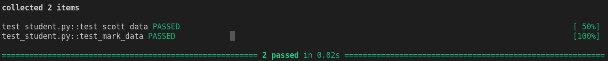
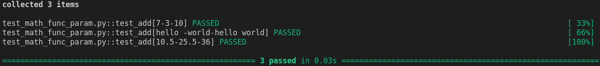

Wazuh-Test
==========

This repository solves Wazuh QA Technical Test 

# Task 4

## Code execution 🚀

Under Fixture folder run the next command

pytest -v test_student.py

the expected result is:

Under Parametrize folder run the next command

pytest -v test_math_func_param.py 

the expected result is:

## Author 👥

* **[Federico Pacher](https://github.com/fedepacher)**: Project creation and mantainance.

## License 📄

This project was created under MIT license ([MIT](https://choosealicense.com/licenses/mit/)).