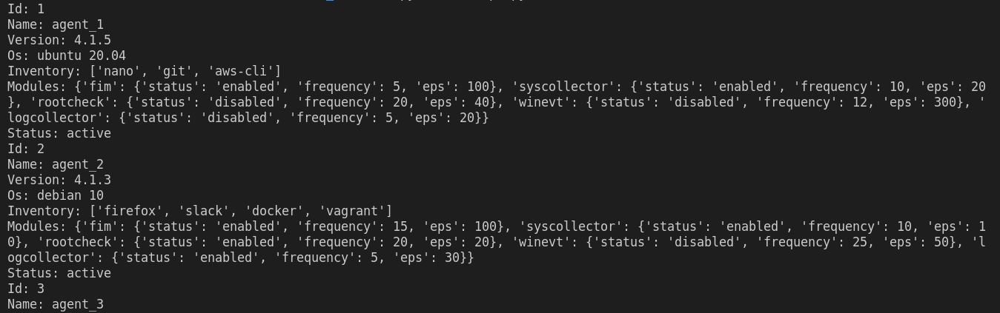
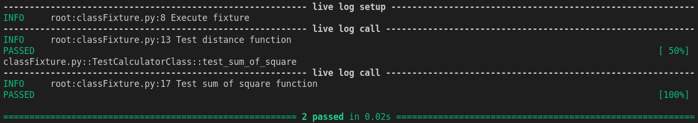
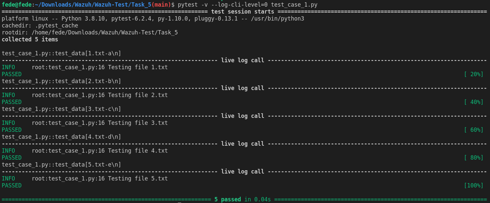
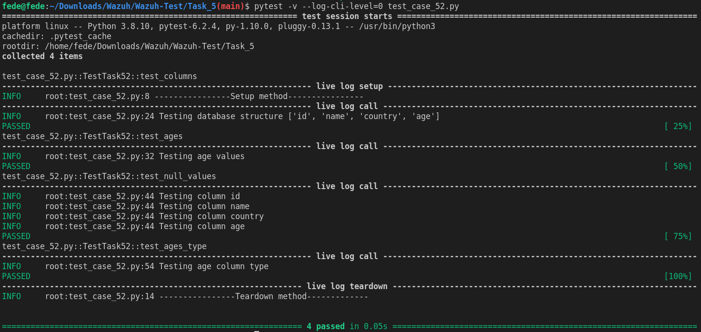

Wazuh-Test
==========

This repository solves Wazuh QA Technical Test.

Each task does not have its description to maintain the privacy of the Wazuh test.

This repository is accompanied by a pdf file that details the procedures and results of the resolution of each task. 

# Task 3

## Code execution 🚀

Under `Task_3/` folder run the next command:

```
python3 script.py
```
the expected result is:




# Task 4

## Code execution 🚀

Under `Task_4/Fixture/Module` folder run the next command:

```
pytest -v test_student.py
```
the expected result is:


Under `Task_4/Fixture/Class` folder run the next command:

```
pytest -v --log-cli-level=0 classFixture.py
```
the expected result is:



Under `Task_4/Parametrize` folder run the next command:

```
pytest -v test_math_func_param.py 
```
the expected result is:


# Task 5

## Code execution 🚀

Under `Task_5/` folder run the next command to verify that the content of the input files has the expected value.

`{'1.txt': 'a', '2.txt': 'b', '3.txt': 'c', '4.txt':’d’, '5.txt': 'e'}`

```
pytest -v --log-cli-level=0 test_case_51.py
```
the expected result is:




Under `Task_5/` folder run the next command to verify `clients.db` file content.


```
pytest -v --log-cli-level=0 test_case_52.py
```
the expected result is:




## Author 👥

* **[Federico Pacher](https://github.com/fedepacher)**: Project creation and mantainance.

## License 📄

This project was created under MIT license ([MIT](https://choosealicense.com/licenses/mit/)).